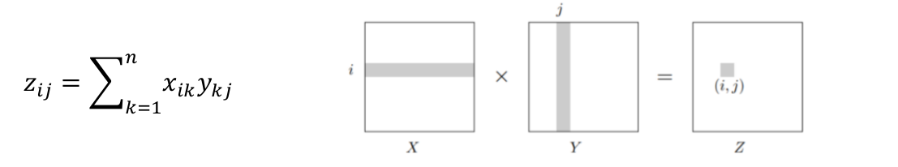

# Divide-and-Conquer-for-Matrix-Multiplication

## Problem Introduction:
The goal in this problem is to find the product of multiplying two matrices X and Y using divide-
and-conquer.
The product of two n × n matrices X and Y is a third n × n matrix Z = XY , with (i, j) th entry
 
 
## Problem Description
Given two square matrices X and Y of size n x n each , find their product XY n x n using a
divide and conquer approach. Hint: Partitioning
Input Format. The input consists of 2 matrices each of size n x n .
Output Format. Output the n x n matrix Z=XY
1. What is the time complexity of a naïve approach?
2. What is the time complexity of the used divide-and-conquer approach?
### Bonus
>Use another divide-and-conquer approach that has a lower time complexity than the used
approach. Hint: Polynomial Multiplication
